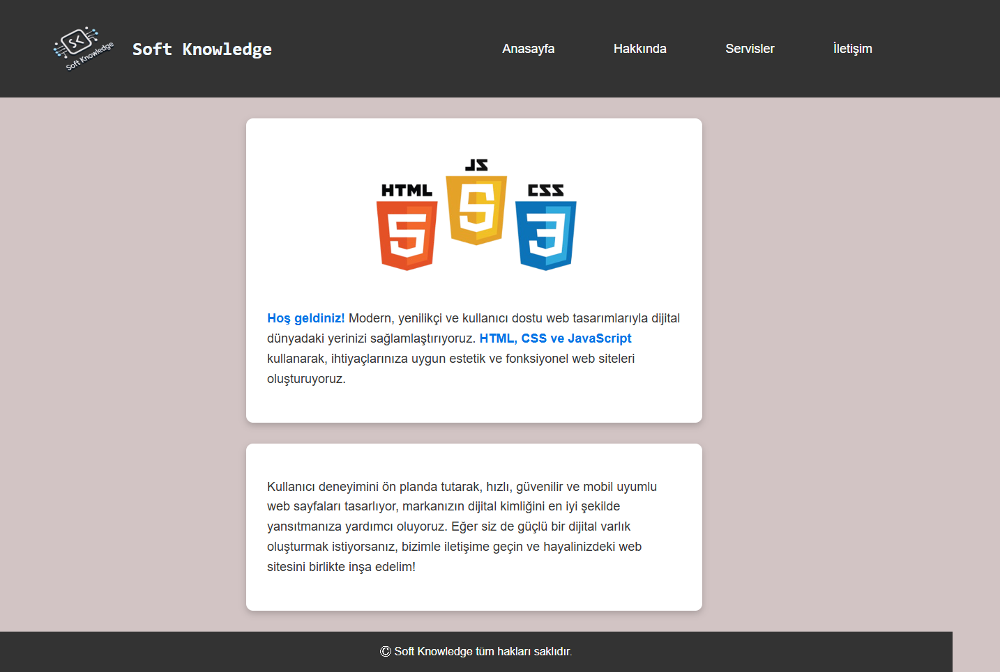
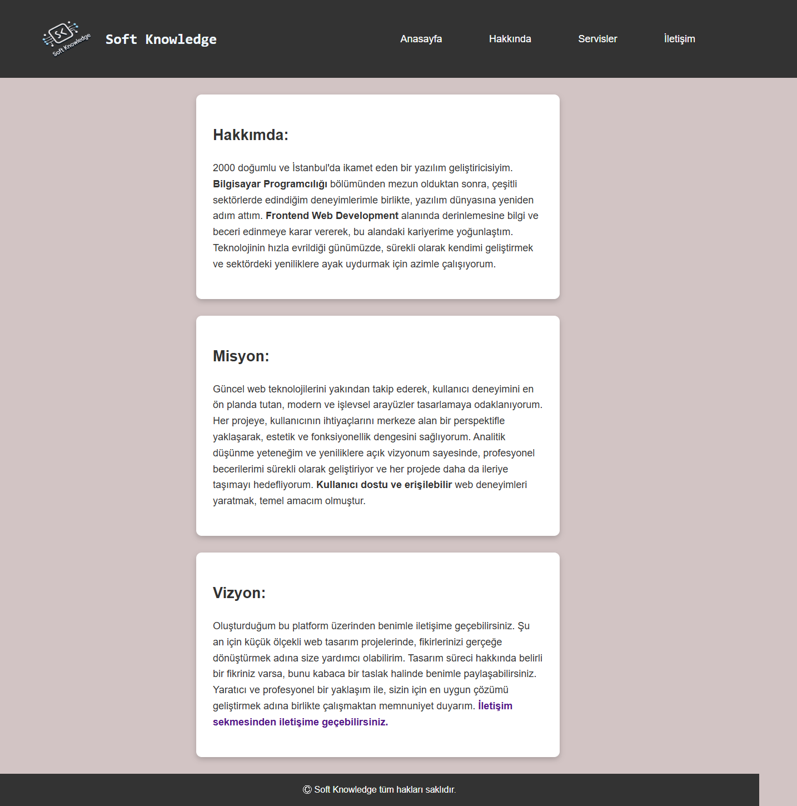
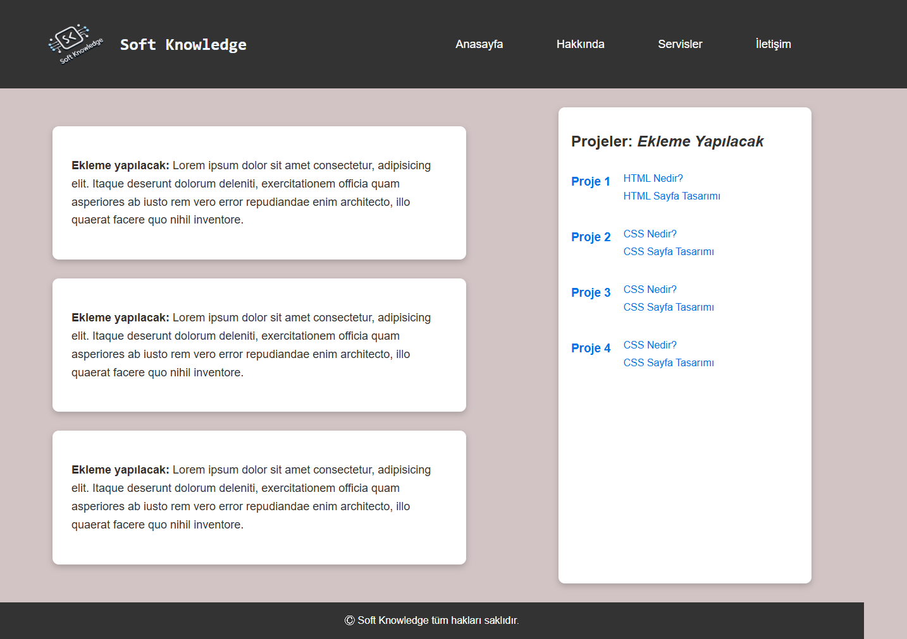
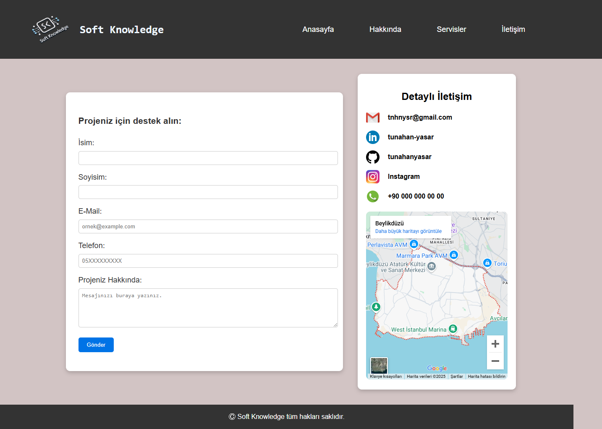

# 📚 Soft Knowledge | Guide Website

[🇹🇷 Türkçe versiyon için tıklayın](./README.tr.md)

* This project is created for Patika Frontend Bootcamp as **Week-1 / Assignment-3 | HTML and CSS** project.
* A guide website developed using **HTML** and **CSS**.
* Semantic HTML tags and modern web design principles are used.

---

## :computer: Usage

1. Clone the project
```bash
git clone https://github.com/tunahanyasar/guide-website-html.git
```

2. Navigate to the project directory
```bash
cd guide-website-html
```

3. Open `index.html` in a web browser
   - By double-clicking the file
   - Or using a local server (e.g., VS Code Live Server extension)

---

## 📜 Project Content

### 1. Brand and Design
- First, I created my own brand and designed my logo with the help of **chatGPT** and used it as a **favicon**.
- Created 4 **HTML** pages named *Home, About, Contact, and Services*.
  - Aimed to use **Semantic Tags** as properly as possible while creating the pages.

### 2. Page Structures

#### Home Page
- Created **header** and **footer** that will be present on every page.
  - Added my logo and brand name to the **header** section.
  - Added **nav** inside the **header** to create navigation between pages using **li and a** tags.
- Created two **div** elements to provide general information and add images.

#### About
- Created three paragraphs to fill the about section.

#### Services
- Created a **section** and added three separate paragraphs inside.
- Added a template for future projects in the **aside** section using **nav**.

#### Contact
- Created a **section** and added a **form** for users to get in touch.
- Added other contact methods in the **aside** section.

---

## 💡 Technologies Used

**HTML:**
* Semantic Tags
* Meta Tags
* Favicon
* Form Elements
* Navigation Structure

**CSS:**
* Layout Management
* Responsive Design
* Custom Properties
* Style Attributes

---

## 📸 Page Outputs

### Home Page


### About


### Services


### Contact


---

## 🎯 Project Goals

1. **User Experience**
   - Easy navigation
   - Responsive design
   - Modern appearance

2. **Content Organization**
   - Organized information hierarchy
   - Logical page structure
   - Easily accessible content

3. **Technical Achievements**
   - Semantic HTML usage
   - Modern design with CSS
   - Form and contact integration

---

## 📞 Contact

[Tunahan Yaşar](https://github.com/tunahanyasar)

* GitHub: [@tunahanyasar](https://github.com/tunahanyasar)
* LinkedIn: [Tunahan Yaşar](https://www.linkedin.com/in/tunahan-yasar/) 